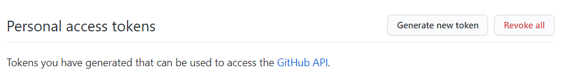
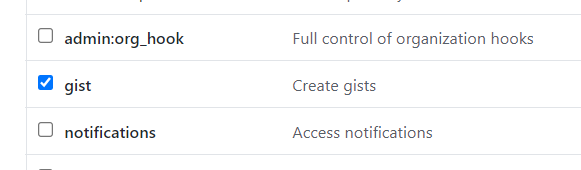
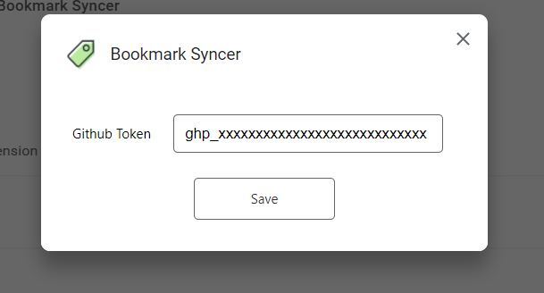
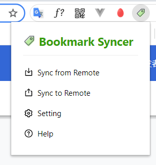

# bookmark-syncer
A Chrome Extension for Bookmark Sync. [中文文档](./README-CN.md)

## features

- sync bookmarks from remote (gists)
- sync bookmarks to remote
- across devices
- no server, no worry about data security and privacy
- support github gists and gitee gists both
- support chrome/edge, etc.

> [gists](https://gist.github.com/) of Github / gists of [Gitee](https://gitee.com/) is used to store your bookmarks data (private)

## get started

First of all, you should have a github account, which we use it to create a gist, to store your bookmarks.

secondly, generate a github private access token:

go to [https://github.com/settings/tokens](https://github.com/settings/tokens)

click **Generate new token**

pick scope: gist

copy your access token like: "ghp_xxxxxxxxxxxxx"

fill in the setting

and that is all, enjoy this tool

